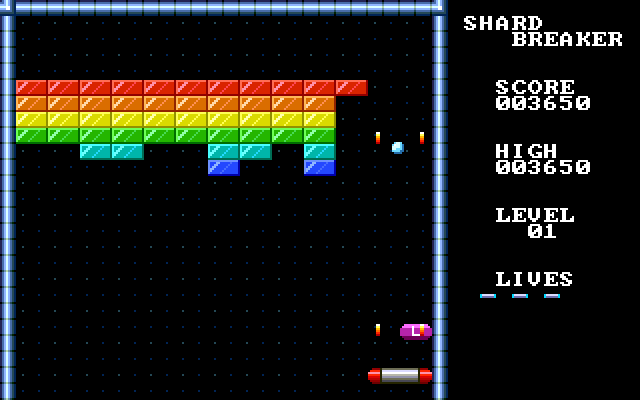
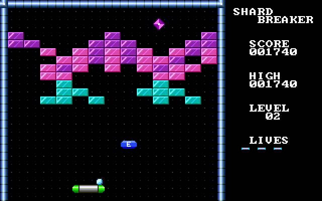

# usvc-devkit

An emulator, SDK and tools for writing games for the
[uSVC](https://github.com/next-hack/uSVC) console without the hardware, and
a game made with them.

uSVC (uChip Simple VGA Console) is an open-source retro console designed by
Nicola Wrachien of [next-hack](https://next-hack.com) together with Itaca
Innovation: an ATSAMD21 Cortex-M0+ that generates VGA and sound in software.
Everything here builds on their work. Games are compiled against the
[uSVC kernel](https://github.com/next-hack/uSVC), and the emulator was
written by reading it. If you like this, go and look at the original
project, its [games](https://github.com/next-hack?tab=repositories) and the
articles on next-hack.com.

This is an independent project and is not affiliated with next-hack or Itaca
Innovation.

- **Emulator** (`crates/`): runs unmodified uSVC game packages (`.usc`) in a
  window with sound, keyboard and gamepad, or headless for automated tests.
- **SDK** (`sdk/`): builds games with `arm-none-eabi-gcc` against the
  upstream kernel.
- **Tools** (`tools/`): package (`usc.py`), artwork (`gfx.py`) and music
  (`song.py`) converters.
- **Shardbreaker** (`games/shardbreaker`): a brick-breaking game.
  See its [README](games/shardbreaker/README.md).

| | |
|---|---|
|  |  |
|  |  |

Shardbreaker running in the emulator: 320x200 pixels, 256 colours, tiles and
sprites drawn by the console's own kernel.

Nothing here has been tested on a real console yet.

## Getting started

Needs Rust, SDL2, `uv`, and for building games the Arm GNU toolchain
(`brew install sdl2 uv` and `brew install --cask gcc-arm-embedded` on macOS).

```sh
git submodule update --init --depth 1
cargo build --release

# play a shipped game
./target/release/usvc "reference/uSVC/usc packages/Tetris.usc"

# build and play Shardbreaker
make -C sdk GAME=../games/shardbreaker play
```

## Documentation

- [Making a game](docs/making-a-game.md): from an empty directory to a
  package, with the rules that are easy to break
- [The emulator](docs/emulator.md): options, the run summary, what is and
  is not emulated
- [How the console works](docs/hardware.md): timing, video modes, memory
  layout, the package format
- `CLAUDE.md`: commands and conventions for working in this repository

## Licence

Copyright (C) 2026 Michael Wulff Nielsen.

This program is free software: you can redistribute it and/or modify it under
the terms of the GNU General Public License as published by the Free Software
Foundation, either version 3 of the License, or (at your option) any later
version. It is distributed without any warranty. See [LICENSE](LICENSE).

That covers the emulator, the SDK files, the tools, and the games including
their artwork, levels and music.

### Other people's work

- **uSVC kernel, game loader and example games** by Nicola Wrachien
  (next-hack.com), GPL-3.0-or-later. They are git submodules under
  `reference/` and are not copied into this repository. A built game package
  contains the kernel, which is why games must be GPL too. The kernel in turn
  includes the Uzebox sound engine by Alec Bourque (GPL), `printf` by Marco
  Paland (MIT), Petit FatFs by ChaN, and Microchip device headers
  (Apache-2.0).
- **CMSIS core headers** in `sdk/cmsis/`, Copyright Arm Limited, Apache-2.0
  (`sdk/cmsis/LICENSE.txt`).
- The keyboard translation in `crates/usvc-core/src/hle.rs` is ported from
  the uSVC kernel.

uSVC and uChip are names of their respective owners.

## Thanks

To Nicola Wrachien and next-hack for designing the console, writing the
kernel and publishing all of it under a free licence.
