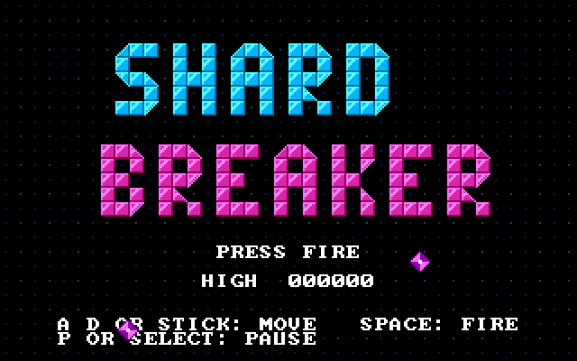
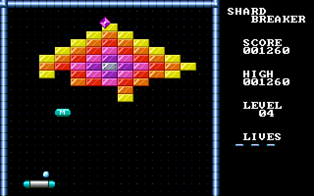

# Shardbreaker

A brick-breaking game for the uSVC console. Original artwork, levels and
sounds.




## Playing

| | Keyboard | Gamepad |
|---|---|---|
| Move the paddle | A / D or left / right arrow | stick or direction pad (the stick is analogue) |
| Launch the ball, confirm | space or enter | buttons 1-4 or start |
| Pause | P | select |

Break every brick to clear a level. Steel bricks take two hits; gold bricks
cannot be broken. Some bricks drop a capsule; catch it with the paddle:

- **E** – wider paddle
- **Z** – laser paddle: hold fire to shoot bricks
- **C** – catch paddle: the ball sticks; press fire to let it go
- **S** – slows the ball back to its starting speed
- **M** – splits one ball into three
- **L** – extra life (up to five)

E, Z and C replace each other, and all three end when you lose the ball.

Wisps drift down from the top now and then. They pass over bricks and do no
harm, but they knock the ball back when it hits them. The ball, a laser bolt
or the paddle destroys them for points.

There are thirteen levels. Clearing the last one earns a bonus, and the levels
then start over with a faster ball.

The ball speeds up as you keep it in play. Leave the title screen alone for
about fifteen seconds and the game plays a silent demo; press fire to stop it.

## Building

From the repository root:

```sh
make -C sdk GAME=../games/shardbreaker play      # build and play in a window
make -C sdk GAME=../games/shardbreaker run       # build, run headless, screenshot
make -C sdk GAME=../games/shardbreaker assets    # after editing artwork or songs
```

The package for the SD card is `build/shardbreaker/shardbreaker.usc`.

## Files

- `main.c` – start-up, frame loop, keyboard and gamepad input
- `game.c` – paddle, balls, bricks, capsules, game states, demo
- `screen.c` – tile drawing and text
- `levels.c` – level layouts as text; add a level by adding a block of 14
  strings and raising `NUM_LEVELS`
- `patches.c` – sound effects and the instruments the songs use
- `music/` – songs as text (see `tools/song.py` for the format); the
  `assets` target converts them too
- `game.mk` – the title, description, author, date and version shown in the
  game loader's menu
- `assets/` – `tiles.png` and `sprites.png` with their name lists; edit them
  in any paint program, then run the `assets` target. `make_art.py` drew the
  first version and overwrites hand edits if run again. `preview.png` is the
  picture for the game loader's menu.
- `gen/` – C generated from the artwork and songs by `tools/gfx.py` and
  `tools/song.py`

## Testing aid

Built with `EMULATOR=1`, these keys work during play: 1-6 hand out a capsule
(E S M L Z C), 9 clears the level, and 0 switches an autopilot on or
off. The normal build has none of this.
